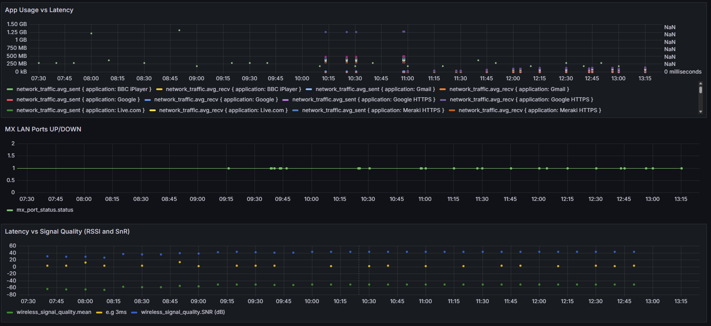

# 🛰️ Meraki Monitoring with InfluxDB and Grafana



**Comprehensive network analytics using the Meraki Dashboard API, InfluxDB, and Grafana deployed and orchestrated with Ansible, Terraform, and GitHub Actions to collect and store data beyond the Meraki dashboard, enabling deeper trend monitoring and troubleshooting.**

---

## 🔧 Features

* ✅ Modular Python scripts to pull:

  * Channel utilization history
  * Latency per AP
  * Average RSSI & SNR over time
  * AP channel history
  * Wireless client count
  * Top devices by data usage
  * Top network applications (via traffic analysis)
  * SNMP device up/down checks (MX LAN Port Monitoring) 
* ✅ InfluxDB for time-series data storage
* ✅ Grafana dashboards to visualize trends and troubleshoot performance
* ✅ Deployed with Ansible on Ubuntu 24.04
* ✅ Optional provisioning via Terraform (Proxmox)
* ✅ CI/CD via GitHub Actions (with self-hosted runner)

---

## 📂 Project Structure

```
meraki-monitoring/
├── ansible/                  # Playbooks and inventory
├── terraform/                # Optional: VM provisioning (e.g. Proxmox)
├── complete/                 # Finalized Python scripts (modular)
│   ├── ap_channel_status.py
│   ├── ap_channel_utilisation.py
│   ├── ap_latency.py
│   ├── ap_signal_quality.py
│   ├── client_count_history.py
│   ├── top_applications.py
│   ├── top_devices.py
│   ├── snmp_up_down.py
│   └── run_meraki_scripts.sh   # Orchestrator
├── .env                     # Secure credentials (not committed)
├── requirements.txt         # Python deps
├── site.yml                 # Ansible playbook
├── inventory.ini            # Target hosts
├── README.md
```

---

## ⚙️ Requirements

* Ubuntu 24.04 or Debian-based host
* Python 3.10+
* Ansible 2.14+
* InfluxDB 1.x (locally or remote)
* Grafana
* Meraki API key with read access
* GitHub Actions + self-hosted runner
* Access to the Meraki Cloud API

---

## 🚀 Installation

### 1. Clone the Repository

```bash
git clone https://github.com/yourusername/meraki-monitoring.git
cd meraki-monitoring
```

### 2. Configure Environment

Create a `.env` file:

```ini
MERAKI_API_KEY=your_api_key
NETWORK_ID=your_network_id
ORG_ID=your_organization_id
BAND=5
```

### 3. Deploy with Ansible

```bash
ansible-playbook -i inventory.ini site.yml
```

This installs InfluxDB, Grafana, Python, and dependencies.

---

## 🧪 Usage

### Activate Virtual Environment

```bash
source /opt/meraki-monitoring/venv/bin/activate
```

### Run All Scripts

```bash
cd complete
./run_meraki_scripts.sh
```

This runs all metrics scripts in order, each writing to InfluxDB.

Sample output:

```
Running Channel History Script:
Wrote 30 points for device serial
...
Running Top Network Usage Apps Script:
Wrote 41 traffic points to InfluxDB
```

You can schedule this via cron/systemd for automation.

---

## 📊 Grafana Setup

* Visit: `http://<your_vm_ip>:3000`
* Default login: `admin / admin`
* Add InfluxDB data source:

  * URL: `http://localhost:8086`
  * Database: `meraki`
* Import custom dashboards or build your own using:

  * Measurement: `wireless_latency_history`, `client_count`, `channel_utilisation`, etc.
  * Tags: `serial`, `model`, `band`

### 🔍 Visualization Grafana Querie examples

* Pending

---

## 🛠️ Troubleshooting

| Component     | Check With                                                      |
| ------------- | --------------------------------------------------------------- |
| InfluxDB      | `systemctl status influxdb` / logs at `/var/log/influxdb/`      |
| Grafana       | `systemctl status grafana-server` / logs at `/var/log/grafana/` |
| API errors    | Ensure your `.env` has valid API key and network/org ID         |
| Python issues | Enable verbose logging or print stack traces                    |

---

## ✅ Roadmap

* 📈 Publish reusable Grafana dashboards (JSON export)
* 🌐 Support multiple orgs/networks dynamically
* 🧪 Unit testing + Pylint for scripts
